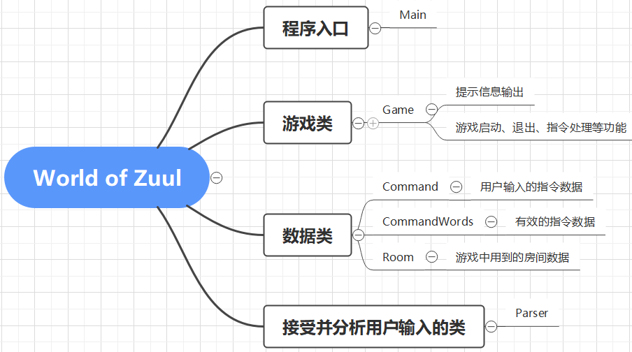
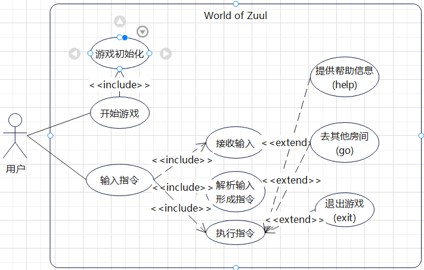
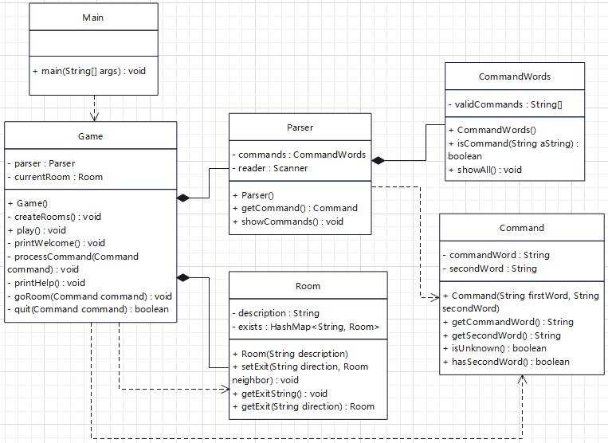
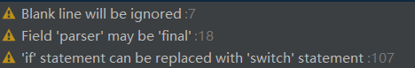
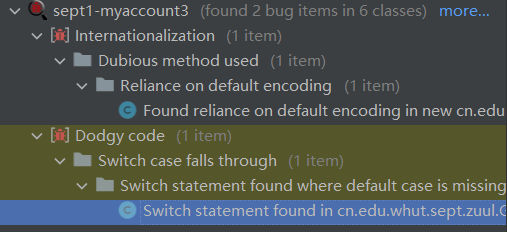

# 软件工程实训一Report

## 1.阅读和描述样例工程

### 1.1 样例工程的代码逻辑
样例工程采用了面向对象的设计思想，将程序中出现的事物抽象为各种类，并为其定义相关方法。
本样例工程中，共定义了`Command`、`CommandWords`、`Game`、`Main`、`Parser`、`Room`这些类。
样例工程通过`Main`类中的`main`函数作为整个程序的入口。在`main`函数中，建立一个新的`Game`类对象`game`，并通过调用`game`对象的`play()`方法开始游戏。
在`Game`类中，包含了一些其他类的对象，提供了用于游戏具体逻辑实现的一些方法。这些方法通常还会调用其他类中负责逻辑实现的方法，从而实现程序运行逻辑。

### 1.2 代码结构及部件组成
如1.1所述，`Main`类中的`main`函数作为整个程序的入口，`Game`类提供游戏对象和游戏中各种功能需要调用的方法，其他各类则主要负责处理样例工程中用到的数据，以及接收并分析用户输入、提供输出等。
项目的代码结构及部件组成可以用下图表示：

### 1.3 以UML图描述样例工程的组成及结构图
#### 1.3.1 用例图
分析本样例工程，可以看出，本样例工程包括用户这一个主要人员，用户主要有开始游戏、输入指令这两个基本用例。
其中，“开始游戏”用例包含了“游戏初始化”这个用例，“输入指令”用例则包含接收输入、执行指令等用例。在“执行指令”用例中，根据指令，可以扩展出一些其他用例。


#### 1.3.2 类图
##### 1.3.2.1 样例工程各类之间的关系分析
###### 1.3.2.1.1 `Main`
在`Main`类中，生成了一个`Game`类对象`game`，并调用了`game`对象的方法。因此，`Main`和`Game`类间存在依赖关系，`Main`类依赖于`Game`类。

###### 1.3.2.1.2 `Game`
`Game`类中，`Parser`类和`Room`类对象作为成员变量，表明`Game`和`Parser`、`Room`存在组合关系。
`Game`类中`quit()`方法以`Command`类的对象作为参数，表明`Game`类与`Command`类之间存在依赖关系，`Game`类依赖于`Command`类。
`Game`类中`createRooms()`方法建立了`Room`类的对象，调用了`Room`类方法，表明`Game`类与`Room`类存在依赖关系，`Game`类依赖于`Room`类。

###### 1.3.2.1.3 `Parser`
在`Parser`类中，`CommandWords`类的对象作为成员变量，表明`Parser`和`CommandWords`类之间存在组合关系。
`Parser`类中`getCommand()`方法以`Command`类的对象作为参数，表明`Parser`类与`Command`类之间存在依赖关系，`Parser`类依赖于`Command`类。

##### 1.3.2.2 UML类图
根据上面的分析，可绘制出本样例工程的UML类图：


## 2.标注样例工程中的代码
运用`javadoc`规范，参考`Game`类代码，可以将程序中的其他类代码进行注释，以提高代码的可读性。
添加注释后的部分代码如下所示：
```java
// FileName: Room.java
/**
 * {@code Room}类用来保存程序中用到的各个房间的相关信息。
 */
public class Room {
    /** {@code Room}类对象的描述信息 */
    private final String description;
    /** 该{@code Room}类对象在东、西、南、北方向的其他{@code Room}类对象 */
    private final HashMap<String, Room> exits;

    /**
     * 构造函数。
     * @param description {@code Room}类对象的描述信息
     */
    public Room(String description) {
        this.description = description;
        exits = new HashMap<>();
    }
    // 剩余代码篇幅所限不展示
}
```
完整代码已经提交至GitHub，可在GitHub上在线查看。

## 3.扩充和维护样例工程
### 3.1 消除项目中的警告
最开始的项目中有很多警告。根据警告内容，可将警告消除，从而提高代码质量。


### 3.2 使用代码质量分析工具SpotBugs检查代码
使用SpotBugs可以找到代码中潜在的问题：


### 3.3 程序优化
#### 3.3.1 `Game`类中`processCommand()`方法的优化
在`Game`类的`processCommand()`方法中，当用户输入的命令被辨认出来以后，有一系列的`if`语句用来分派程序到不同的地方去执行。从面向对象的设计原则来看，这种解决方案不太好，因为每当要加入一个新的命令时，就得在这一堆`if`语句中再加入一个`if`分支，最终会导致这个方法的代码膨胀得极其臃肿。
我的改进方法是修改对应的代码，在`Game`类中使用`HashMap`对象保存指令字符串及其对应的处理类，在`processCommand()`方法中通过`get()`函数获取处理类对象，调用该对象的`process()`方法实现指令处理。
样例工程中，新建一个`CommandProcessor`接口，提供一个`process()`方法。指令处理类都必须实现(`implements`)该接口。
下面是修改前后的`processCommand()`方法对比：
```java
// FileName: Game.java
public class Game {
    // ...
    /**
     * 执行用户输入的游戏指令.
     * @param command 待处理的游戏指令，由解析器从用户输入内容生成.
     * @return 如果执行的是游戏结束指令，则返回 {@code true}，否则返回 {@code false}.
     */
    private boolean processCommand(Command command)
    {
//        boolean wantToQuit = false;

        if(command.isUnknown()) {
            System.out.println("I don't know what you mean...");
            return false;
        }

        String commandWord = command.getCommandWord();
        var processor = commandProcessorHashMap.get(commandWord);
        if (processor != null) {
            return processor.process(command);
        }

        // else command not recognised.
        return false;

//        switch (commandWord) {
//            case "help" -> printHelp();
//            case "go" -> goRoom(command);
//            case "quit" -> wantToQuit = quit(command);
//        }

    }
    // ...
}
```
可以看到，修改后的代码直接使用`process()`方法处理指令，避免了`if-else`语句和`switch`语句的使用，体现了面向对象的程序设计思想，将实现的具体细节封装起来，避免了面向过程的程序设计思想。
修改后的代码也提高了可复用性，以后如果要加入新的指令，这部分代码仍然适用，只需要在这部分代码之外对`commandProcessorHashMap`稍作修改即可，而无需像原来那样新增`if-else`分支或`switch-case`分支。
下面是新增的指令处理类，在`Game`类中定义：
```java
// FileName: Game.java
public class Game {
    // ...
    /**
     * {@code help}指令的处理类
     */
    private class HelpCommandProcessor implements CommandProcessor {
        @Override
        public boolean process(Command command) {
            printHelp();
            return false;
        }
    }
    // ...
}
```

#### 3.3.2 对`CommandWords`类的优化
`Game`中的`processCommand()`方法的实现修改后，对`CommandWords`类也进行优化处理。
根据程序功能，`CommandWords`类保存所有有效的指令字符串，并提供判断指令有效性、显示索引指令的方法。由于代码修改后，在`Game`类中已经有保存有效的指令字符串及其处理类的`commandProcessorHashMap`对象，在`CommandWords`类中，可利用该对象改写内部方法。
在`Main`类中，可定义一个`static`公有变量`currentGame`，`main`函数中新建`Game`对象时，即把该对象赋给`currentGame`变量。
```java
// FileName: Main.java
/**
 * {@code Main}类是“World-of-Zuul”应用程序的启动类。
 * {@code Main}类通过其中的{@code main}方法启动整个应用程序。
 */
public class Main {
    public static Game currentGame;

    public static void main(String[] args) {
        currentGame = new Game(); // 游戏初始化
        currentGame.playerListInit();   // 读取已经注册的玩家
        currentGame.play();    // 启动游戏
    }
}
```
`CommandWords`类中，通过调用`Main.currentGame.getCommandProcessorHashMap()`方法保存`currentGame.commandProcessorHashMap`，类中方法的实现只需使用这个对象即可。
下图是代码修改后`CommandWords`类中`isCommand()`方法的实现：
```java
// FileName: CommandWords.java
// ...
/**
 * {@code CommandWords}类保存所有有效的指令字符串，并提供判断指令有效性、显示索引指令的方法。
 */
public class CommandWords {
    /** 有效的指令字符串及其处理类 */
    private static final HashMap<String, CommandProcessor> commandProcessorHashMap
            = Main.currentGame.getCommandProcessorHashMap();

    /**
     * 判断指令的有效性。
     * @param aString 指令字符串
     * @return 若指令有效，返回{@code true}；若指令无效，返回{@code false}。
     */
    public static boolean isCommand(String aString) {
//        // 顺序查找
//        for(var item: validCommands) {
//            if(item.equals(aString))
//                return true;
//        }
//        return false;
        return commandProcessorHashMap.get(aString) != null;
    }
    // ...
}
```
如图所示，`isCommand()`方法由原来的顺序查找变成了在`HashMap`中查找，代码量也压缩至1行。
同时，相比原来的顺序查找，改进后的代码也降低了时间复杂度，提高了程序的性能。

## 4.功能扩充
### 4.1 控制台指令扩充及Player类的设计
在样例工程中，增加控制台命令及其处理类，并增设玩家(`Player`)类，实现程序的功能扩充。
本次指令扩充，增加了注册(`register`)、登录(`login`)、登出(`logout`)、返回(`back`)等指令，新建`Player`类，使程序功能更完善。
```java
// FileName: Game.java
// ...
public class Game
{
    // ...
    /**
     * 构造函数，创建游戏并初始化内部数据和解析器.
     */
    public Game()
    {
        createRooms();
        parser = new Parser();
        commandProcessorHashMap = new HashMap<>();

        commandProcessorHashMap.put("help", new HelpCommandProcessor());
        commandProcessorHashMap.put("go", new GoCommandProcessor());
        commandProcessorHashMap.put("quit", new QuitCommandProcessor());
        commandProcessorHashMap.put("back", new BackCommandProcessor());
        commandProcessorHashMap.put("register", new RegisterCommandProcessor());
        commandProcessorHashMap.put("login", new LoginCommandProcessor());
        commandProcessorHashMap.put("logout", new LogoutCommandProcessor());

//        currentPlayer = null;
//        playerList = null;
//        startRoom = null;
    }
    // ...
}
```
指令扩充后，程序支持用户注册、登录、登出、返回等新功能。
新功能中，注册、登录要求玩家输入用户名和密码，使用`ArrayList`集合保存注册后的玩家信息。程序中原来存在的`go`等指令则只有用户登录后才能成功执行。
`logout`指令必须由用户登录后才能执行。`back`指令可以实现退回玩家到达的前一个`room`的功能。
`Player`类保存了用户名、密码、当前房间、房间访问记录等信息。
本设计的缺点是每次停止运行后，由`ArrayList`保存的注册玩家信息便会丢掉。4.2将解决这个问题。

### 4.2 为游戏增加数据库功能
新建一个mysql包，存放用来连接mysql数据库及对数据库中数据进行读取、写入的类。
功能扩充后，在新用户注册时，即将用户的用户名和密码信息写入数据库。
注册的玩家信息仍用`ArrayList`集合存储，但是是利用mysql包中的数据库读取方法，从数据库中读取数据后，生成`ArrayList`数据集合，以`ArrayList`形式返回的。
新用户注册时，既将用户信息添加到`ArrayList`集合，也将用户的用户名和密码信息写入数据库。

### 4.3 为游戏增加图形界面
新建一个GUI包，实现图形界面。使用java中的`swing`包生成图形界面。图形界面的主要功能仍参考控制台应用的实现。
完整的带注释的代码已提交至GitHub。
由于图形界面所有指令均用按钮显示，可点击图形界面右上角的“×”退出，因此图形界面没有提供`help`和`quit`指令。
图形界面不仅实现了控制台应用的功能，而且更直观，人机交互更友好。同时，图形界面中的指令均通过点击按钮实现，避免了控制台应用中输入指令不合法的问题。

## 5.编写测试用例
利用JUnit测试工具，在程序中新增`test`包，存放JUnit测试类。
在测试类中，主要通过`assertEquals()`、`assertTrue()`等方法检查程序中控制台应用的各类中的方法能否输出正确结果，从而检查方法功能是否正常。
```java
// FileName: RoomTest.java
// ...
/**
 * 测试{@code Room}类中的方法。
 */
class RoomTest {
    @Test
    void setExit() {
        Room room1 = new Room("room1");
        Room room2 = new Room("room2");
        room1.setExit("east", room2);

        assertEquals(room2, room1.getExit("east"));
    }

    @Test
    void getLongDescription() {
        Room room1 = new Room("room1");
        Room room2 = new Room("room2");
        room1.setExit("east", room2);

//        System.out.println(room1.getLongDescription());
        assertEquals("You are room1.\nExits: east", room1.getLongDescription());
    }

//    setExit()方法测试中已经对getExit()方法进行了测试。
//    @Test
//    void getExit() {
//        setExit();
//    }
}
```
运行JUnit测试，`test`包中所有测试的方法均测试通过，验证了程序功能的正确性。
详细代码已提交至GitHub，可在GitHub上查看。
